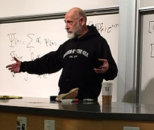

<table class="infobox biography vcard">
<tbody>
<tr>
<th colspan="2">

Leonard Susskind

</th>
</tr>
<tr>
<td colspan="2">

Leonard Susskind

</td>
</tr>
<tr>
<th scope="row">Born</th>
<td>May&nbsp;1940 (age&nbsp;80) 

<a title="South Bronx" href="https://en.wikipedia.org/wiki/South_Bronx">South Bronx</a>,&nbsp;<a title="New York City" href="https://en.wikipedia.org/wiki/New_York_City">New York City</a>, US

</td>
</tr>
<tr>
<th scope="row">Nationality</th>
<td class="category">United States</td>
</tr>
<tr>
<th scope="row">Citizenship</th>
<td class="category">United States</td>
</tr>
<tr>
<th scope="row">Alma&nbsp;mater</th>
<td><a title="City College of New York" href="https://en.wikipedia.org/wiki/City_College_of_New_York">City College of New York</a> <a title="Cornell University" href="https://en.wikipedia.org/wiki/Cornell_University">Cornell University</a></td>
</tr>
<tr>
<th scope="row">Known&nbsp;for</th>
<td><a title="Holographic principle" href="https://en.wikipedia.org/wiki/Holographic_principle">Holographic principle</a> <a title="String theory" href="https://en.wikipedia.org/wiki/String_theory">String theory</a> <a title="Matrix theory (physics)" href="https://en.wikipedia.org/wiki/Matrix_theory_(physics)">Matrix theory (physics)</a> <a title="String theory landscape" href="https://en.wikipedia.org/wiki/String_theory_landscape">String theory landscape</a> <a title="Color confinement" href="https://en.wikipedia.org/wiki/Color_confinement">Color confinement</a> <a title="Hamiltonian lattice gauge theory" href="https://en.wikipedia.org/wiki/Hamiltonian_lattice_gauge_theory">Hamiltonian lattice gauge theory</a> <a title="RST model" href="https://en.wikipedia.org/wiki/RST_model">RST model</a> <a title="Susskind&ndash;Glogower operator" href="https://en.wikipedia.org/wiki/Susskind%E2%80%93Glogower_operator">Susskind&ndash;Glogower operator</a> <a title="Kogut&ndash;Susskind fermion" href="https://en.wikipedia.org/wiki/Kogut%E2%80%93Susskind_fermion">Kogut&ndash;Susskind fermions</a> <a title="Fischler&ndash;Susskind mechanism" href="https://en.wikipedia.org/wiki/Fischler%E2%80%93Susskind_mechanism">Fischler&ndash;Susskind mechanism</a> <a title="ER=EPR" href="https://en.wikipedia.org/wiki/ER%3DEPR">ER=EPR</a></td>
</tr>
<tr>
<th scope="row">Awards</th>
<td><a title="Pomeranchuk Prize" href="https://en.wikipedia.org/wiki/Pomeranchuk_Prize">Pomeranchuk Prize</a>&nbsp;(2008) <a class="new" title="American Institute of Physics' Science Writing Award (page does not exist)" href="https://en.wikipedia.org/w/index.php?title=American_Institute_of_Physics%27_Science_Writing_Award&amp;action=edit&amp;redlink=1">American Institute of Physics' Science Writing Award</a> <a title="Sakurai Prize" href="https://en.wikipedia.org/wiki/Sakurai_Prize">Sakurai Prize</a>&nbsp;(1998) <a class="new" title="Boris Pregel Award (page does not exist)" href="https://en.wikipedia.org/w/index.php?title=Boris_Pregel_Award&amp;action=edit&amp;redlink=1">Boris Pregel Award</a>,&nbsp;<a title="New York Academy of Sciences" href="https://en.wikipedia.org/wiki/New_York_Academy_of_Sciences">New York Academy of Sciences</a>&nbsp;(1975)</td>
</tr>
<tr>
<td colspan="2"><strong>Scientific career</strong></td>
</tr>
<tr>
<th scope="row">Fields</th>
<td class="category"><a title="Physics" href="https://en.wikipedia.org/wiki/Physics">Physics</a>,&nbsp;<a title="Mathematics" href="https://en.wikipedia.org/wiki/Mathematics">mathematics</a></td>
</tr>
<tr>
<th scope="row">Institutions</th>
<td><a title="Yeshiva University" href="https://en.wikipedia.org/wiki/Yeshiva_University">Yeshiva University</a> <a title="Tel Aviv University" href="https://en.wikipedia.org/wiki/Tel_Aviv_University">Tel Aviv University</a> <a title="Stanford University" href="https://en.wikipedia.org/wiki/Stanford_University">Stanford University</a> <a title="Stanford Institute for Theoretical Physics" href="https://en.wikipedia.org/wiki/Stanford_Institute_for_Theoretical_Physics">Stanford Institute for Theoretical Physics</a> <a title="Korea Institute for Advanced Study" href="https://en.wikipedia.org/wiki/Korea_Institute_for_Advanced_Study">Korea Institute for Advanced Study</a> <a title="Perimeter Institute for Theoretical Physics" href="https://en.wikipedia.org/wiki/Perimeter_Institute_for_Theoretical_Physics">Perimeter Institute for Theoretical Physics</a></td>
</tr>
<tr>
<th scope="row"><a title="Thesis" href="https://en.wikipedia.org/wiki/Thesis">Thesis</a></th>
<td><a class="external text" href="http://search.proquest.com/docview/302316918" rel="nofollow"><em>Quantum mechanical approach to strong interactions</em></a>&nbsp;(1965)</td>
</tr>
<tr>
<th scope="row"><a title="Doctoral advisor" href="https://en.wikipedia.org/wiki/Doctoral_advisor">Doctoral advisor</a></th>
<td><a title="Peter A. Carruthers" href="https://en.wikipedia.org/wiki/Peter_A._Carruthers">Peter A. Carruthers</a></td>
</tr>
<tr>
<th scope="row">Doctoral students</th>
<td><a title="Eduardo Fradkin" href="https://en.wikipedia.org/wiki/Eduardo_Fradkin">Eduardo Fradkin</a> <a title="Douglas Stanford" href="https://en.wikipedia.org/wiki/Douglas_Stanford">Douglas Stanford</a></td>
</tr>
</tbody>
</table>
 

<strong>Leonard Susskind</strong>&nbsp;(<a title="Help:IPA/English" href="https://en.wikipedia.org/wiki/Help:IPA/English">/ˈsʌskɪnd/</a>; born 1940)&nbsp;is an American physicist, who is a professor of&nbsp;<a title="Theoretical physics" href="https://en.wikipedia.org/wiki/Theoretical_physics">theoretical physics</a>&nbsp;at&nbsp;<a title="Stanford University" href="https://en.wikipedia.org/wiki/Stanford_University">Stanford University</a>, and founding director of the&nbsp;<a title="Stanford Institute for Theoretical Physics" href="https://en.wikipedia.org/wiki/Stanford_Institute_for_Theoretical_Physics">Stanford Institute for Theoretical Physics</a>. His research interests include&nbsp;<a title="String theory" href="https://en.wikipedia.org/wiki/String_theory">string theory</a>,&nbsp;<a title="Quantum field theory" href="https://en.wikipedia.org/wiki/Quantum_field_theory">quantum field theory</a>,&nbsp;<a title="Quantum statistical mechanics" href="https://en.wikipedia.org/wiki/Quantum_statistical_mechanics">quantum statistical mechanics</a>&nbsp;and&nbsp;<a title="Quantum cosmology" href="https://en.wikipedia.org/wiki/Quantum_cosmology">quantum cosmology</a>.&nbsp;He is a member of the US&nbsp;<a title="National Academy of Sciences" href="https://en.wikipedia.org/wiki/National_Academy_of_Sciences">National Academy of Sciences</a>,&nbsp;and the&nbsp;<a title="American Academy of Arts and Sciences" href="https://en.wikipedia.org/wiki/American_Academy_of_Arts_and_Sciences">American Academy of Arts and Sciences</a>,&nbsp;an associate member of the faculty of&nbsp;<a title="Canada" href="https://en.wikipedia.org/wiki/Canada">Canada</a>'s&nbsp;<a title="Perimeter Institute for Theoretical Physics" href="https://en.wikipedia.org/wiki/Perimeter_Institute_for_Theoretical_Physics">Perimeter Institute for Theoretical Physics</a>,&nbsp;and a distinguished professor of the&nbsp;<a title="Korea Institute for Advanced Study" href="https://en.wikipedia.org/wiki/Korea_Institute_for_Advanced_Study">Korea Institute for Advanced Study</a>.

Susskind is widely regarded as one of the fathers of&nbsp;<a title="String theory" href="https://en.wikipedia.org/wiki/String_theory">string theory</a>.&nbsp;He was the first to give a precise string-theoretic interpretation of the&nbsp;<a title="Holographic principle" href="https://en.wikipedia.org/wiki/Holographic_principle">holographic principle</a>&nbsp;in 1995&nbsp;and the first to introduce the idea of the&nbsp;<a title="String theory landscape" href="https://en.wikipedia.org/wiki/String_theory_landscape">string theory landscape</a>&nbsp;in 2003.

Susskind was awarded the&nbsp;<a title="Sakurai Prize" href="https://en.wikipedia.org/wiki/Sakurai_Prize">1998 J. J. Sakurai Prize</a>,&nbsp;and the&nbsp;<a title="Oskar Klein Memorial Lecture" href="https://en.wikipedia.org/wiki/Oskar_Klein_Memorial_Lecture">2018 Oskar Klein Medal</a>.

 

<h2> Publications </h2>

<ul>

                             

 <li><a target="_blank" href="https://github.com/manjunath5496/Leonard-Susskind-Publications/blob/master/lsu(1).pdf" style="text-decoration:none;">The Census Taker's Hat</a></li>

 <li><a target="_blank" href="https://github.com/manjunath5496/Leonard-Susskind-Publications/blob/master/lsu(2).pdf" style="text-decoration:none;">Future Foam</a></li>

<li><a target="_blank" href="https://github.com/manjunath5496/Leonard-Susskind-Publications/blob/master/lsu(3).pdf" style="text-decoration:none;">Fast Scramblers</a></li>
 <li><a target="_blank" href="https://github.com/manjunath5496/Leonard-Susskind-Publications/blob/master/lsu(4).pdf" style="text-decoration:none;">Census Taking in the Hat:
FRW/CFT Duality</a></li>                              
<li><a target="_blank" href="https://github.com/manjunath5496/Leonard-Susskind-Publications/blob/master/lsu(5).pdf" style="text-decoration:none;">On the Topological Phases of Eternal Inflation</a></li>
<li><a target="_blank" href="https://github.com/manjunath5496/Leonard-Susskind-Publications/blob/master/lsu(6).pdf" style="text-decoration:none;">Crunches, Hats, and a Conjecture</a></li>
 <li><a target="_blank" href="https://github.com/manjunath5496/Leonard-Susskind-Publications/blob/master/lsu(7).pdf" style="text-decoration:none;">Addendum to Fast Scramblers</a></li>

 <li><a target="_blank" href="https://github.com/manjunath5496/Leonard-Susskind-Publications/blob/master/lsu(8).pdf" style="text-decoration:none;"> The Multiverse Interpretation of Quantum Mechanics</a></li>
   <li><a target="_blank" href="https://github.com/manjunath5496/Leonard-Susskind-Publications/blob/master/lsu(9).pdf" style="text-decoration:none;">Eternal Symmetree</a></li>
  
   
 <li><a target="_blank" href="https://github.com/manjunath5496/Leonard-Susskind-Publications/blob/master/lsu(10).pdf" style="text-decoration:none;">The Three Faces of a Fixed Point </a></li>                              
<li><a target="_blank" href="https://github.com/manjunath5496/Leonard-Susskind-Publications/blob/master/lsu(11).pdf" style="text-decoration:none;">Fractal-Flows and Time's Arrow</a></li>
<li><a target="_blank" href="https://github.com/manjunath5496/Leonard-Susskind-Publications/blob/master/lsu(12).pdf" style="text-decoration:none;">Was There a Beginning?</a></li>
<li><a target="_blank" href="https://github.com/manjunath5496/Leonard-Susskind-Publications/blob/master/lsu(13).pdf" style="text-decoration:none;">Is Eternal In
ation Past-Eternal? And What if It Is?</a></li>

<li><a target="_blank" href="https://github.com/manjunath5496/Leonard-Susskind-Publications/blob/master/lsu(14).pdf" style="text-decoration:none;">Black Holes: Complementarity or Firewalls?</a></li>
                              
<li><a target="_blank" href="https://github.com/manjunath5496/Leonard-Susskind-Publications/blob/master/lsu(15).pdf" style="text-decoration:none;">Singularities, Firewalls, and Complementarity</a></li>

<li><a target="_blank" href="https://github.com/manjunath5496/Leonard-Susskind-Publications/blob/master/lsu(16).pdf" style="text-decoration:none;">The Transfer of Entanglement:
The Case for Firewalls</a></li>

  <li><a target="_blank" href="https://github.com/manjunath5496/Leonard-Susskind-Publications/blob/master/lsu(17).pdf" style="text-decoration:none;">Black Hole Complementarity and the Harlow-Hayden Conjecture</a></li>   
  
<li><a target="_blank" href="https://github.com/manjunath5496/Leonard-Susskind-Publications/blob/master/lsu(18).pdf" style="text-decoration:none;">Cool horizons for entangled black holes</a></li> 

  
<li><a target="_blank" href="https://github.com/manjunath5496/Leonard-Susskind-Publications/blob/master/lsu(19).pdf" style="text-decoration:none;">Towards String Theory models of DeSitter Space and early Universe Cosmology</a></li> 

<li><a target="_blank" href="https://github.com/manjunath5496/Leonard-Susskind-Publications/blob/master/lsu(20).pdf" style="text-decoration:none;">New Concepts for Old Black Holes</a></li>

<li><a target="_blank" href="https://github.com/manjunath5496/Leonard-Susskind-Publications/blob/master/lsu(21).pdf" style="text-decoration:none;">Butterflies on the Stretched Horizon</a></li>
<li><a target="_blank" href="https://github.com/manjunath5496/Leonard-Susskind-Publications/blob/master/lsu(22).pdf" style="text-decoration:none;">Computational Complexity and
Black Hole Horizons</a></li> 
 <li><a target="_blank" href="https://github.com/manjunath5496/Leonard-Susskind-Publications/blob/master/lsu(23).pdf" style="text-decoration:none;">Addendum to Computational Complexity and Black Hole Horizons</a></li> 
 

   <li><a target="_blank" href="https://github.com/manjunath5496/Leonard-Susskind-Publications/blob/master/lsu(24).pdf" style="text-decoration:none;">Observational Consequences of a Landscape: Epilogue</a></li>
 
   <li><a target="_blank" href="https://github.com/manjunath5496/Leonard-Susskind-Publications/blob/master/lsu(25).pdf" style="text-decoration:none;">Deconfinement transition as black hole formation by the condensation of QCD strings</a></li>                              
 <li><a target="_blank" href="https://github.com/manjunath5496/Leonard-Susskind-Publications/blob/master/lsu(26).pdf" style="text-decoration:none;">Complexity and Shock Wave Geometries</a></li>
 <li><a target="_blank" href="https://github.com/manjunath5496/Leonard-Susskind-Publications/blob/master/lsu(27).pdf" style="text-decoration:none;">Switchbacks and The Bridge to Nowhere</a></li>
   
 
   <li><a target="_blank" href="https://github.com/manjunath5496/Leonard-Susskind-Publications/blob/master/lsu(28).pdf" style="text-decoration:none;">Localized shocks</a></li>
 
   <li><a target="_blank" href="https://github.com/manjunath5496/Leonard-Susskind-Publications/blob/master/lsu(29).pdf" style="text-decoration:none;">Entanglement is not Enough</a></li>                              

  <li><a target="_blank" href="https://github.com/manjunath5496/Leonard-Susskind-Publications/blob/master/lsu(30).pdf" style="text-decoration:none;">ER=EPR, GHZ, and the Consistency of Quantum Measurements</a></li>
 
   <li><a target="_blank" href="https://github.com/manjunath5496/Leonard-Susskind-Publications/blob/master/lsu(31).pdf" style="text-decoration:none;">The Typical-State Paradox:
Diagnosing Horizons with Complexity</a></li> 
    <li><a target="_blank" href="https://github.com/manjunath5496/Leonard-Susskind-Publications/blob/master/lsu(32).pdf" style="text-decoration:none;">Electromagnetic Memory</a></li> 

   <li><a target="_blank" href="https://github.com/manjunath5496/Leonard-Susskind-Publications/blob/master/lsu(33).pdf" style="text-decoration:none;">Complexity Equals Action</a></li>                              

  <li><a target="_blank" href="https://github.com/manjunath5496/Leonard-Susskind-Publications/blob/master/lsu(34).pdf" style="text-decoration:none;">Complexity, action, and black holes</a></li> 
 
  <li><a target="_blank" href="https://github.com/manjunath5496/Leonard-Susskind-Publications/blob/master/lsu(35).pdf" style="text-decoration:none;">Copenhagen vs Everett,
Teleportation, and ER=EPR</a></li> 

  <li><a target="_blank" href="https://github.com/manjunath5496/Leonard-Susskind-Publications/blob/master/lsu(36).pdf" style="text-decoration:none;">Quantum Complexity and Negative Curvature</a></li> 
 
<li><a target="_blank" href="https://github.com/manjunath5496/Leonard-Susskind-Publications/blob/master/lsu(37).pdf" style="text-decoration:none;">de Sitter as a Resonance</a></li>
 <li><a target="_blank" href="https://github.com/manjunath5496/Leonard-Susskind-Publications/blob/master/lsu(38).pdf" style="text-decoration:none;">The Second Law of Quantum Complexity</a></li>
<li><a target="_blank" href="https://github.com/manjunath5496/Leonard-Susskind-Publications/blob/master/lsu(39).pdf" style="text-decoration:none;">Teleportation Through the Wormhole</a></li>
 <li><a target="_blank" href="https://github.com/manjunath5496/Leonard-Susskind-Publications/blob/master/lsu(40).pdf" style="text-decoration:none;">Dear Qubitzers,
GR=QM</a></li>                              
<li><a target="_blank" href="https://github.com/manjunath5496/Leonard-Susskind-Publications/blob/master/lsu(41).pdf" style="text-decoration:none;">Why do Things Fall?</a></li>
<li><a target="_blank" href="https://github.com/manjunath5496/Leonard-Susskind-Publications/blob/master/lsu(42).pdf" style="text-decoration:none;">Black Holes and Complexity Classes</a></li>
 
  <li><a target="_blank" href="https://github.com/manjunath5496/Leonard-Susskind-Publications/blob/master/lsu(43).pdf" style="text-decoration:none;">Falling Toward Charged Black Holes</a></li>
 <li><a target="_blank" href="https://github.com/manjunath5496/Leonard-Susskind-Publications/blob/master/lsu(44).pdf" style="text-decoration:none;">Entanglement Holonomies</a></li>
   <li><a target="_blank" href="https://github.com/manjunath5496/Leonard-Susskind-Publications/blob/master/lsu(45).pdf" style="text-decoration:none;">PiTP Lectures on Complexity and Black Holes, Lecture I</a></li>  
   
<li><a target="_blank" href="https://github.com/manjunath5496/Leonard-Susskind-Publications/blob/master/lsu(46).pdf" style="text-decoration:none;">The Case of the Missing Gates:
Complexity of Jackiw-Teitelboim Gravity</a></li> 
                             
<li><a target="_blank" href="https://github.com/manjunath5496/Leonard-Susskind-Publications/blob/master/lsu(47).pdf" style="text-decoration:none;">Three Lectures on Complexity and Black Holes</a></li>
<li><a target="_blank" href="https://github.com/manjunath5496/Leonard-Susskind-Publications/blob/master/lsu(48).pdf" style="text-decoration:none;">The Complexity Geometry of a Single Qubit</a></li>

<li><a target="_blank" href="https://github.com/manjunath5496/Leonard-Susskind-Publications/blob/master/lsu(49).pdf" style="text-decoration:none;">Complexity and Newton's Laws </a></li>
                              
<li><a target="_blank" href="https://github.com/manjunath5496/Leonard-Susskind-Publications/blob/master/lsu(50).pdf" style="text-decoration:none;">Complexity Geometry and Schwarzian Dynamics</a></li>
<li><a target="_blank" href="https://github.com/manjunath5496/Leonard-Susskind-Publications/blob/master/lsu(51).pdf" style="text-decoration:none;">Quantum Gravity in the Lab:
Teleportation by Size and Traversable Wormholes</a></li>
<li><a target="_blank" href="https://github.com/manjunath5496/Leonard-Susskind-Publications/blob/master/lsu(52).pdf" style="text-decoration:none;">The Python's Lunch:
geometric obstructions to decoding Hawking radiation</a></li>

<li><a target="_blank" href="https://github.com/manjunath5496/Leonard-Susskind-Publications/blob/master/lsu(53).pdf" style="text-decoration:none;">Horizons Protect Church-Turing</a></li>
 
<li><a target="_blank" href="https://github.com/manjunath5496/Leonard-Susskind-Publications/blob/master/lsu(54).pdf" style="text-decoration:none;">Black Holes at Exp-time </a></li>

<li><a target="_blank" href="https://github.com/manjunath5496/Leonard-Susskind-Publications/blob/master/lsu(55).pdf" style="text-decoration:none;">Complexity and Momentum</a></li>
 
  <li><a target="_blank" href="https://github.com/manjunath5496/Leonard-Susskind-Publications/blob/master/lsu(56).pdf" style="text-decoration:none;">A Sparse Model of Quantum Holography </a></li>                              

  <li><a target="_blank" href="https://github.com/manjunath5496/Leonard-Susskind-Publications/blob/master/lsu(57).pdf" style="text-decoration:none;">TASI lectures on the Holographic Principle</a></li>
 
   <li><a target="_blank" href="https://github.com/manjunath5496/Leonard-Susskind-Publications/blob/master/lsu(58).pdf" style="text-decoration:none;">The IR/UV Connection
in Non–Commutative Gauge Theories</a></li>
    <li><a target="_blank" href="https://github.com/manjunath5496/Leonard-Susskind-Publications/blob/master/lsu(59).pdf" style="text-decoration:none;">Invasion of the Giant Gravitons from Anti de Sitter Space</a></li>
 
  <li><a target="_blank" href="https://github.com/manjunath5496/Leonard-Susskind-Publications/blob/master/lsu(60).pdf" style="text-decoration:none;">Gauge Symmetry and Localized Gravity in M Theory </a></li>
 
   <li><a target="_blank" href="https://github.com/manjunath5496/Leonard-Susskind-Publications/blob/master/lsu(61).pdf" style="text-decoration:none;">Bosonic M Theory</a></li>
 
   <li><a target="_blank" href="https://github.com/manjunath5496/Leonard-Susskind-Publications/blob/master/lsu(62).pdf" style="text-decoration:none;">The Quantum Hall Fluid and
Non–Commutative Chern Simons Theory</a></li>
 
   <li><a target="_blank" href="https://github.com/manjunath5496/Leonard-Susskind-Publications/blob/master/lsu(63).pdf" style="text-decoration:none;">String Theory and Quintessence</a></li>                              

  <li><a target="_blank" href="https://github.com/manjunath5496/Leonard-Susskind-Publications/blob/master/lsu(64).pdf" style="text-decoration:none;">Realizing the Quantum Hall System in String Theory</a></li>
 
   <li><a target="_blank" href="https://github.com/manjunath5496/Leonard-Susskind-Publications/blob/master/lsu(65).pdf" style="text-decoration:none;">A Two Fluid Description of the Quantum Hall Soliton</a></li> 

   <li><a target="_blank" href="https://github.com/manjunath5496/Leonard-Susskind-Publications/blob/master/lsu(66).pdf" style="text-decoration:none;">String Theory and
the Size of Hadrons</a></li> 
 
   <li><a target="_blank" href="https://github.com/manjunath5496/Leonard-Susskind-Publications/blob/master/lsu(67).pdf" style="text-decoration:none;">Is There Really
a de Sitter/CFT Duality</a></li>                              

  <li><a target="_blank" href="https://github.com/manjunath5496/Leonard-Susskind-Publications/blob/master/lsu(68).pdf" style="text-decoration:none;">Twenty Years of Debate
with Stephen</a></li> 
 
  
   <li><a target="_blank" href="https://github.com/manjunath5496/Leonard-Susskind-Publications/blob/master/lsu(69).pdf" style="text-decoration:none;">Disturbing Implications of a Cosmological Constant</a></li>                              

  <li><a target="_blank" href="https://github.com/manjunath5496/Leonard-Susskind-Publications/blob/master/lsu(70).pdf" style="text-decoration:none;">Initial conditions for inflation</a></li> 
  
 
 <li><a target="_blank" href="https://github.com/manjunath5496/Leonard-Susskind-Publications/blob/master/lsu(71).pdf" style="text-decoration:none;">The Trouble with
De Sitter Space</a></li>
 
 <li><a target="_blank" href="https://github.com/manjunath5496/Leonard-Susskind-Publications/blob/master/lsu(72).pdf" style="text-decoration:none;">The Anthropic Landscape
of String Theory</a></li> 
 
 
 <li><a target="_blank" href="https://github.com/manjunath5496/Leonard-Susskind-Publications/blob/master/lsu(73).pdf" style="text-decoration:none;">1+1 Dimensional Compactifications of String Theory</a></li>
  <li><a target="_blank" href="https://github.com/manjunath5496/Leonard-Susskind-Publications/blob/master/lsu(74).pdf" style="text-decoration:none;">Supersymmetry Breaking in the Anthropic Landscape</a></li>
    <li><a target="_blank" href="https://github.com/manjunath5496/Leonard-Susskind-Publications/blob/master/lsu(75).pdf" style="text-decoration:none;">Naturalness and the Landscape</a></li>                        
<li><a target="_blank" href="https://github.com/manjunath5496/Leonard-Susskind-Publications/blob/master/lsu(76).pdf" style="text-decoration:none;">Cosmic Natural Selection</a></li>

 <li><a target="_blank" href="https://github.com/manjunath5496/Leonard-Susskind-Publications/blob/master/lsu(77).pdf" style="text-decoration:none;">A Framework for the Landscape</a></li> 
 
 
 <li><a target="_blank" href="https://github.com/manjunath5496/Leonard-Susskind-Publications/blob/master/lsu(78).pdf" style="text-decoration:none;">Wormholes and Time Travel? Not Likely</a></li>
  <li><a target="_blank" href="https://github.com/manjunath5496/Leonard-Susskind-Publications/blob/master/lsu(79).pdf" style="text-decoration:none;">Rebuttal to a Paper on Wormholes</a></li>

 <li><a target="_blank" href="https://github.com/manjunath5496/Leonard-Susskind-Publications/blob/master/lsu(80).pdf" style="text-decoration:none;">Observational Consequences of a Landscape</a></li> 
 
 
 <li><a target="_blank" href="https://github.com/manjunath5496/Leonard-Susskind-Publications/blob/master/lsu(81).pdf" style="text-decoration:none;">A Holographic Framework for Eternal Inflation</a></li>
  <li><a target="_blank" href="https://github.com/manjunath5496/Leonard-Susskind-Publications/blob/master/lsu(82).pdf" style="text-decoration:none;">Susskind's Challenge to the
Hartle-Hawking No-Boundary Proposal and Possible Resolutions</a></li>

 <li><a target="_blank" href="https://github.com/manjunath5496/Leonard-Susskind-Publications/blob/master/lsu(83).pdf" style="text-decoration:none;">Holographic Views of the World</a></li>
  <li><a target="_blank" href="https://github.com/manjunath5496/Leonard-Susskind-Publications/blob/master/lsu(84).pdf" style="text-decoration:none;">Information loss and anomalous scattering</a></li>

 <li><a target="_blank" href="https://github.com/manjunath5496/Leonard-Susskind-Publications/blob/master/lsu(85).pdf" style="text-decoration:none;">String Theory and the Principle of Black Hole Complementarity</a></li>
  <li><a target="_blank" href="https://github.com/manjunath5496/Leonard-Susskind-Publications/blob/master/lsu(86).pdf" style="text-decoration:none;">Strings, Black Holes and Lorentz Contraction</a></li>

 <li><a target="_blank" href="https://github.com/manjunath5496/Leonard-Susskind-Publications/blob/master/lsu(87).pdf" style="text-decoration:none;">Some speculations about black hole entropy in string theory</a></li>
  <li><a target="_blank" href="https://github.com/manjunath5496/Leonard-Susskind-Publications/blob/master/lsu(88).pdf" style="text-decoration:none;">Comment On A Proposal By Strominger</a></li>
  <li><a target="_blank" href="https://github.com/manjunath5496/Leonard-Susskind-Publications/blob/master/lsu(89).pdf" style="text-decoration:none;">The World as a Hologram</a></li>
  
  
  <li><a target="_blank" href="https://github.com/manjunath5496/Leonard-Susskind-Publications/blob/master/lsu(90).pdf" style="text-decoration:none;">Trouble For Remnants</a></li>
  <li><a target="_blank" href="https://github.com/manjunath5496/Leonard-Susskind-Publications/blob/master/lsu(91).pdf" style="text-decoration:none;">GRAVITY AND GLOBAL SYMMETRIES</a></li>

 <li><a target="_blank" href="https://github.com/manjunath5496/Leonard-Susskind-Publications/blob/master/lsu(92).pdf" style="text-decoration:none;">Black Hole Complementarity vs. Locality</a></li>
  <li><a target="_blank" href="https://github.com/manjunath5496/Leonard-Susskind-Publications/blob/master/lsu(93).pdf" style="text-decoration:none;"> Particle Growth and BPS Saturated States</a></li>
  <li><a target="_blank" href="https://github.com/manjunath5496/Leonard-Susskind-Publications/blob/master/lsu(94).pdf" style="text-decoration:none;">String Physics and Black Holes</a></li> 
  
   <li><a target="_blank" href="https://github.com/manjunath5496/Leonard-Susskind-Publications/blob/master/lsu(95).pdf" style="text-decoration:none;">D-branes and Fat Black Holes</a></li>  
  
<li><a target="_blank" href="https://github.com/manjunath5496/Leonard-Susskind-Publications/blob/master/lsu(96).pdf" style="text-decoration:none;">T Duality in M(atrix) Theory and S Duality in field theory</a></li> 
  
  
<li><a target="_blank" href="https://github.com/manjunath5496/Leonard-Susskind-Publications/blob/master/lsu(97).pdf" style="text-decoration:none;">Rotational Invariance in the M(atrix) Formulation of Type IIB Theory</a></li>

 <li><a target="_blank" href="https://github.com/manjunath5496/Leonard-Susskind-Publications/blob/master/lsu(98).pdf" style="text-decoration:none;">Another Conjecture about M(atrix) Theory</a></li> 
  
   <li><a target="_blank" href="https://github.com/manjunath5496/Leonard-Susskind-Publications/blob/master/lsu(99).pdf" style="text-decoration:none;">Finite N Heterotic Matrix Models and Discrete Light Cone Quantiztion</a></li>  
  
<li><a target="_blank" href="https://github.com/manjunath5496/Leonard-Susskind-Publications/blob/master/lsu(100).pdf" style="text-decoration:none;">Schwarzschild Black Holes in Various Dimensions from Matrix Theory</a></li>  
  
 <li><a target="_blank" href="https://github.com/manjunath5496/Leonard-Susskind-Publications/blob/master/lsu(101).pdf" style="text-decoration:none;">A note on discrete light cone quantization</a></li> 
  
 <li><a target="_blank" href="https://github.com/manjunath5496/Leonard-Susskind-Publications/blob/master/lsu(102).pdf" style="text-decoration:none;">Review of Matrix Theory</a></li> 
  
   <li><a target="_blank" href="https://github.com/manjunath5496/Leonard-Susskind-Publications/blob/master/lsu(103).pdf" style="text-decoration:none;">The Holographic Bound in Anti-de Sitter Space</a></li>  
  
<li><a target="_blank" href="https://github.com/manjunath5496/Leonard-Susskind-Publications/blob/master/lsu(104).pdf" style="text-decoration:none;">Matrix Theory Black Holes and the Gross Witten Transition</a></li>  
  
 <li><a target="_blank" href="https://github.com/manjunath5496/Leonard-Susskind-Publications/blob/master/lsu(105).pdf" style="text-decoration:none;">Large N and the Dine-Rajaraman problem</a></li> 
 
  <li><a target="_blank" href="https://github.com/manjunath5496/Leonard-Susskind-Publications/blob/master/lsu(106).pdf" style="text-decoration:none;">Holography in the Flat Space Limit</a></li> 
  
   <li><a target="_blank" href="https://github.com/manjunath5496/Leonard-Susskind-Publications/blob/master/lsu(107).pdf" style="text-decoration:none;">Puzzles and Paradoxes About Holography</a></li>  
  
<li><a target="_blank" href="https://github.com/manjunath5496/Leonard-Susskind-Publications/blob/master/lsu(108).pdf" style="text-decoration:none;">Negative Energy, Superluminosity and Holography </a></li>  
  
 <li><a target="_blank" href="https://github.com/manjunath5496/Leonard-Susskind-Publications/blob/master/lsu(109).pdf" style="text-decoration:none;">Magnetic fields, branes and
noncommutative geometry</a></li> 
 
  <li><a target="_blank" href="https://github.com/manjunath5496/Leonard-Susskind-Publications/blob/master/lsu(110).pdf" style="text-decoration:none;">Wilson loops as Precursors</a></li> 
 
 
 
 
 
 
 
 
  
 
 
 </ul>
